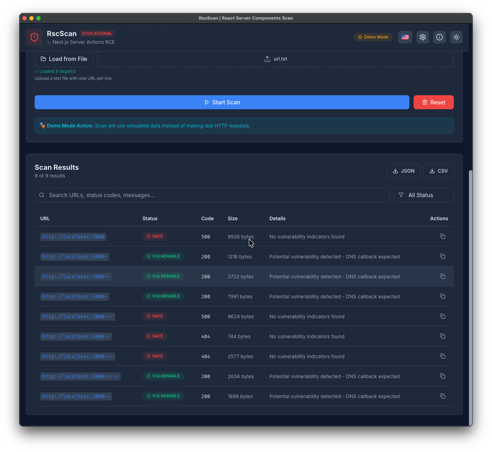
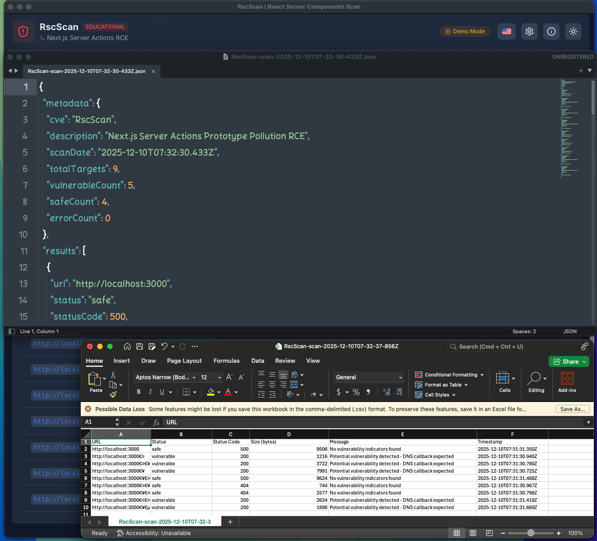
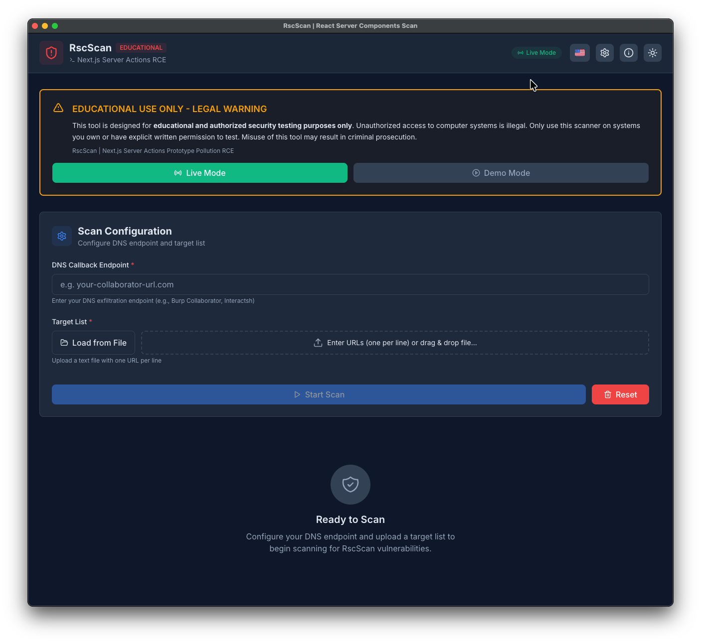
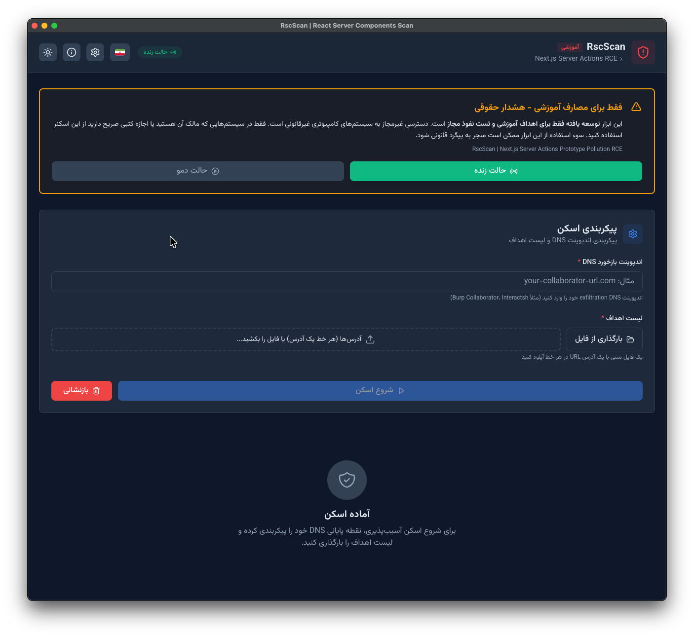
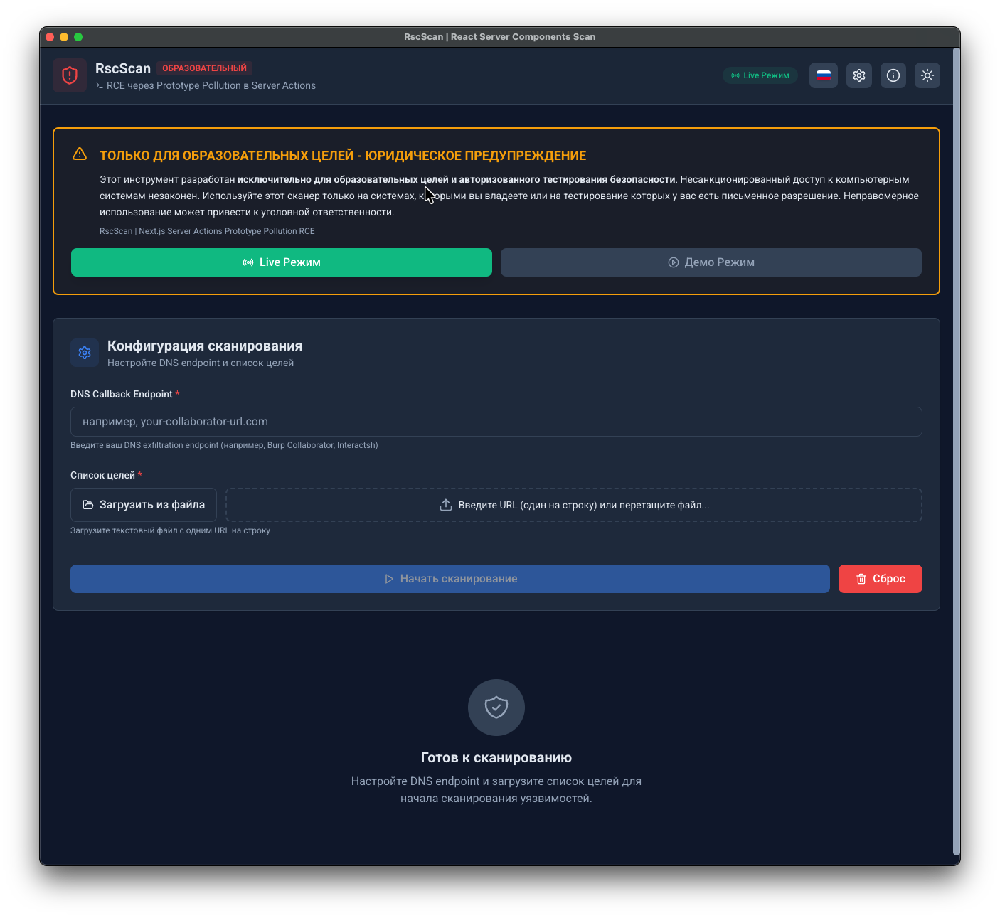
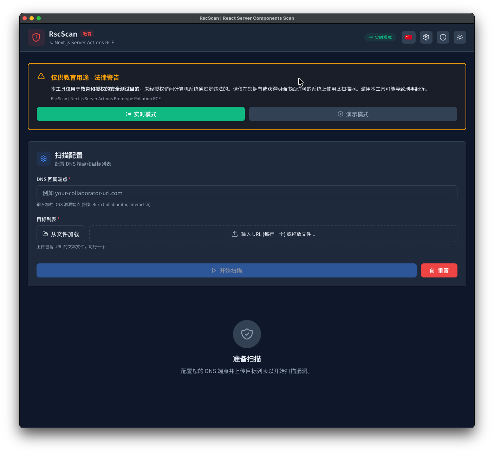

# RscScan - Next.js Server Actions Vulnerability Scanner

<div align="center">


**Professional cross-platform vulnerability scanner for Next.js Server Actions RCE**

[Features](#-features) • [Installation](#-installation) • [Usage](#-usage) • [Video Demo](#-video-demonstration) • [Screenshots](#-screenshots)

<div align="center">

[🇺🇸 English](README.md) • [🇮🇷 فارسی](README_fa.md) • [🇨🇳 简体中文](README_zh.md) • [🇷🇺 Русский](README_ru.md) • [🇩🇪 Deutsch](README_de.md)

</div>

</div>

---

## ⚠️ LEGAL DISCLAIMER

**THIS TOOL IS FOR EDUCATIONAL AND AUTHORIZED SECURITY TESTING PURPOSES ONLY.**

- ❌ **DO NOT** use this tool on systems you do not own or have explicit written permission to test
- ❌ **DO NOT** use this tool for malicious purposes
- ✅ **DO** use this tool only in authorized penetration testing engagements
- ✅ **DO** use this tool for educational research and learning

**Unauthorized access to computer systems is illegal.** Misuse of this tool may result in criminal prosecution under laws such as the Computer Fraud and Abuse Act (CFAA) and similar legislation worldwide.

**By using this tool, you agree to use it responsibly and legally.**

---

## 📋 Table of Contents

- [About](#-about)
- [Features](#-features)
- [Technology Stack](#-technology-stack)
- [Installation](#-installation)
- [Usage](#-usage)
- [Video Demonstration](#-video-demonstration)
- [Screenshots](#-screenshots)
- [Multi-Language Support](#-multi-language-support)
- [Building](#-building)
- [Testing](#-testing)
- [Project Structure](#-project-structure)
- [Contributing](#-contributing)
- [License](#-license)

---

## 🔍 About

**RscScan** is a professional security tool designed to detect CVE-2025-55182, a critical Remote Code Execution (RCE) vulnerability in Next.js Server Actions. The vulnerability stems from a prototype pollution issue that allows attackers to execute arbitrary code on the server.

### Vulnerability Details

| Property | Value |
|----------|-------|
| **CVE ID** | CVE-2025-55182 |
| **CVSS Score** | 9.8 (Critical) |
| **Affected** | Next.js Server Actions |
| **Type** | Prototype Pollution (CVE-2025-55182) → Remote Code Execution |
| **Vector** | HTTP POST request with malicious multipart form data |

---

## ✨ Features

### Core Functionality
- 🎯 **Multi-threaded Scanning** - Concurrent scanning of up to 30 targets simultaneously
- 📊 **Real-time Progress Tracking** - Live progress bar with percentage completion
- 📈 **Statistics Dashboard** - Visual statistics for vulnerable, safe, and error results
- 🔍 **Advanced Filtering** - Search and filter results by status, URL, or message
- 📤 **Multiple Export Formats** - Export results as JSON or CSV
- 🎭 **Demo Mode** - Safe testing mode with simulated results

### Desktop Application Features
- 🖥️ **Cross-Platform** - Windows, macOS, and Linux support
- 📁 **Native File Dialogs** - System file picker for target lists
- 💾 **Native Save Dialogs** - Save exports with system dialog
- 🔔 **In-App Notifications** - Beautiful toast notifications on scan completion
- 🪟 **Window State Persistence** - Remembers window size and position
- 🎨 **System Tray Integration** - Minimize to system tray

### User Interface
- 🌍 **Multi-Language Interface** - Support for English, Persian, Russian, German, and Chinese
- 🌓 **Dark/Light Theme** - Toggle between themes with system preference detection
- 📱 **Responsive Design** - Works seamlessly on desktop, tablet, and mobile
- ⌨️ **Keyboard Shortcuts** - Quick actions with keyboard shortcuts
- 🎨 **Professional Design** - Clean, modern interface with smooth animations
- 🔤 **Custom Fonts** - Language-specific fonts (Vazirmatn for Persian, Noto Sans SC for Chinese)

---

## 🛠 Technology Stack

### Frontend
- **React 19.2.1** - Modern UI library with hooks
- **Vite 5.3** - Lightning-fast build tool and dev server
- **Tailwind CSS 4.1** - Utility-first CSS framework
- **Lucide React** - Beautiful icon library

### Internationalization
- **i18next 25.x** - Internationalization framework
- **react-i18next 16.x** - React integration for i18next
- **i18next-browser-languagedetector** - Automatic language detection

### Desktop Framework
- **Electron 28** - Cross-platform desktop framework
- **Electron Builder 24.9** - Application packaging and distribution

### HTTP Client
- **Axios 1.13** - Promise-based HTTP client

---

## 📥 Download

<div align="left">
<table>
    <thead align="left">
        <tr>
            <th>OS</th>
            <th>Download</th>
        </tr>
    </thead>
    <tbody align="left">
        <tr>
            <td>Windows</td>
            <td>
                <b>Universal (x64 & x86)</b><br>
                <a href="https://github.com/VeilVulp/Rscscan/releases/latest/download/RscScan-Setup-1.0.0.exe"></a>
                <a href="https://github.com/VeilVulp/Rscscan/releases/latest/download/RscScan-Portable-1.0.0.exe"></a><br><br>
                <b>64-bit (x64)</b><br>
                <a href="https://github.com/VeilVulp/Rscscan/releases/latest/download/RscScan-Setup-1.0.0-x64.exe"></a>
                <a href="https://github.com/VeilVulp/Rscscan/releases/latest/download/RscScan-Portable-1.0.0-x64.zip"></a><br><br>
                <b>32-bit (x86)</b><br>
                <a href="https://github.com/VeilVulp/Rscscan/releases/latest/download/RscScan-Setup-1.0.0-ia32.exe"></a>
                <a href="https://github.com/VeilVulp/Rscscan/releases/latest/download/RscScan-Portable-1.0.0-ia32.zip"></a>
            </td>
        </tr>
        <tr>
            <td>macOS</td>
            <td>
                <b>Apple Silicon (M1/M2/M3)</b><br>
                <a href="https://github.com/VeilVulp/Rscscan/releases/latest/download/RscScan-1.0.0-arm64.dmg"></a><br><br>
                <b>Intel (x64)</b><br>
                <a href="https://github.com/VeilVulp/Rscscan/releases/latest/download/RscScan-1.0.0-x64.dmg"></a>
            </td>
        </tr>
        <tr>
            <td>Linux</td>
            <td>
                <a href="https://github.com/VeilVulp/Rscscan/releases/latest/download/RscScan-1.0.0-x86_64.AppImage"> </a><br>
                <a href="https://github.com/VeilVulp/Rscscan/releases/latest/download/RscScan-1.0.0-amd64.deb"> </a>
            </td>
        </tr>
    </tbody>
</table>

</div>

---

## 📦 Installation


### Prerequisites

- **Node.js** 18.x or higher
- **npm** 9.x or higher
- **Git** (for cloning)

### Clone Repository

```bash
git clone https://github.com/VeilVulp/Rscscan.git
cd Rscscan
```

### Install Dependencies

```bash
npm install
```

This will install all required dependencies including React, Electron, i18next, and build tools.

---

## 🚀 Usage

### Web Application (Development Mode)

Perfect for UI development and testing:

```bash
npm run dev
```

The application will open at `http://localhost:5173`

**Note:** Web mode has CORS limitations. For real vulnerability scanning, use the desktop application.

### Desktop Application

#### Development Mode

```bash
npm run electron:dev
```

This will:
1. Start the Vite development server
2. Wait for it to be ready
3. Launch the Electron app with DevTools

#### Production Build

See [BUILD_GUIDE.md](BUILD_GUIDE.md) for detailed build instructions.

---

## 🎥 Video Demonstration

<div align="center">

<video src="screenshots/demo.mp4" controls="controls" style="max-width: 100%;">
</video>

**[🎬 Watch High Quality Video](screenshots/demo.mp4)**

*Complete walkthrough: Installation → Configuration → Multi-Language → Scanning → Export*

</div>

### What's Covered in the Video:
- ✅ Installation and setup process
- ✅ Multi-language interface demonstration (EN, FA, RU, DE, ZH)
- ✅ Theme switching (Dark/Light modes)
- ✅ Target configuration and import
- ✅ Real-time scanning and progress tracking
- ✅ Results analysis and filtering
- ✅ Export options (JSON, CSV)

---

## 📸 Screenshots

<div align="center">

### Application Interface Gallery

<table width="100%">
  <tbody>
    <tr>
      <td align="center" width="50%">
        <h4>🌙 Dark Mode Interface</h4>
        
        <p><em>Professional dark theme with reduced eye strain</em></p>
      </td>
      <td align="center" width="50%">
        <h4>☀️ Light Mode Interface</h4>
        
        <p><em>Clean and modern light interface</em></p>
      </td>
    </tr>
    <tr>
      <td align="center" width="50%">
        <h4>🔍 Active Scanning Process</h4>
        
        <p><em>Real-time progress with live statistics dashboard</em></p>
      </td>
      <td align="center" width="50%">
        <h4>📊 Export Results</h4>
        
        <p><em>Multiple export formats: JSON & CSV with filtering</em></p>
      </td>
    </tr>
  </tbody>
</table>

### Multi-Language Support Preview

<p align="center">
  
  
  
  
</p>
<p align="center">
  <em>Seamless language switching with custom fonts and RTL support</em>
</p>

</div>

---

## 🌍 Multi-Language Support

RscScan provides full interface translation with language-specific optimizations:

| Language | Code | Native Name | Font | Status |
|----------|------|-------------|------|--------|
| 🇺🇸 English | `en` | English | Inter | ✅ Complete |
| 🇮🇷 Persian | `fa` | فارسی | Vazirmatn | ✅ Complete |
| 🇷🇺 Russian | `ru` | Русский | Roboto | ✅ Complete |
| 🇩🇪 German | `de` | Deutsch | Inter | ✅ Complete |
| 🇨🇳 Chinese | `zh` | 简体中文 | Noto Sans SC | ✅ Complete |

### Features:
- ✅ Automatic language detection based on system preferences
- ✅ Manual language switching with persistent settings
- ✅ RTL (Right-to-Left) support for Persian
- ✅ Custom web fonts loaded via Google Fonts
- ✅ Professional flag icons using `country-flag-icons`
- ✅ Complete UI translation (buttons, labels, messages, tooltips)

### Adding a New Language:

1. Create translation file: `src/locales/{language-code}/translation.json`
2. Add language configuration in `src/i18n.js`
3. Add flag mapping in language selector component
4. Update this README with the new language

---

## 🏗️ Building

For detailed build instructions, see [BUILD_GUIDE.md](BUILD_GUIDE.md).

### Quick Build

```bash
# Build for current platform
npm run electron:build

# Build for specific platforms
npm run electron:build:win    # Windows
npm run electron:build:mac    # macOS
npm run electron:build:linux  # Linux
```

**Output:** Built applications will be in the `release/` directory.

---

## 🧪 Testing

For detailed testing instructions, see [TESTING_GUIDE.md](TESTING_GUIDE.md).

### Quick Start

1. **Setup DNS Exfiltration Endpoint**
   - Use Burp Collaborator (https://portswigger.net/burp)
   - Or Interactsh (https://app.interactsh.com)

2. **Create Target List**
   ```text
   https://your-lab-url.web-security-academy.net
   http://localhost:3000
   ```

3. **Run Scanner**
   ```bash
   npm run electron:dev
   ```

---

## 📁 Project Structure

```text
rscscan/
├── electron/                    # Electron main process files
│   ├── main.cjs                # Main process entry point
│   ├── preload.cjs             # Preload script (IPC bridge)
│   └── builder.config.cjs      # Electron Builder configuration
├── src/
│   ├── main.jsx                # React entry point
│   ├── App.jsx                 # Main application component
│   ├── index.css               # Global styles and Tailwind
│   ├── i18n.js                 # i18next configuration
│   ├── components/             # React components
│   ├── services/               # Business logic
│   ├── hooks/                  # Custom React hooks
│   ├── utils/                  # Utility functions
│   ├── locales/                # Translation files
│   │   ├── en/                 # English translations
│   │   ├── fa/                 # Persian translations
│   │   ├── ru/                 # Russian translations
│   │   ├── de/                 # German translations
│   │   └── zh/                 # Chinese translations
│   └── tests/                  # Unit tests
├── screenshots/                # Application screenshots
├── build/                      # Build resources
├── public/                     # Public assets
└── release/                    # Built applications (generated)
```
---

## 🤝 Contributing

Contributions are welcome! Please see [CONTRIBUTING.md](CONTRIBUTING.md) for guidelines.

### Quick Start

1. Fork the repository
2. Create a feature branch (`git checkout -b feature/amazing-feature`)
3. Commit your changes (`git commit -m 'Add amazing feature'`)
4. Push to the branch (`git push origin feature/amazing-feature`)
5. Open a Pull Request

### Translation Contributions

We welcome translations to additional languages! Please follow the structure in `src/locales/en/translation.json` and submit a PR.

---

## 📄 License

MIT License

Copyright (c) 2025 VeilVulp

Permission is hereby granted, free of charge, to any person obtaining a copy
of this software and associated documentation files (the "Software"), to deal
in the Software without restriction, including without limitation the rights
to use, copy, modify, merge, publish, distribute, sublicense, and/or sell
copies of the Software, and to permit persons to whom the Software is
furnished to do so, subject to the following conditions:

The above copyright notice and this permission notice shall be included in all
copies or substantial portions of the Software.

THE SOFTWARE IS PROVIDED "AS IS", WITHOUT WARRANTY OF ANY KIND, EXPRESS OR
IMPLIED, INCLUDING BUT NOT LIMITED TO THE WARRANTIES OF MERCHANTABILITY,
FITNESS FOR A PARTICULAR PURPOSE AND NONINFRINGEMENT. IN NO EVENT SHALL THE
AUTHORS OR COPYRIGHT HOLDERS BE LIABLE FOR ANY CLAIM, DAMAGES OR OTHER
LIABILITY, WHETHER IN AN ACTION OF CONTRACT, TORT OR OTHERWISE, ARISING FROM,
OUT OF OR IN CONNECTION WITH THE SOFTWARE OR THE USE OR OTHER DEALINGS IN THE
SOFTWARE.

---

## 🙏 Acknowledgments

- VeilVulp for development and maintenance
- Next.js team for security disclosures
- Open source security community
- PortSwigger for Web Security Academy
- OWASP for security resources
- Contributors to translation efforts

---

## 📞 Support

- **Issues:** [GitHub Issues](https://github.com/VeilVulp/Rscscan/issues)
- **Email:** veilvulp@gmail.com
- **Instagram:** [@VeilVulp](https://www.instagram.com/veilvulp)
- **YouTube:** [@VeilVulp](https://www.youtube.com/@VeilVulp)

---

<div align="center">

**Remember: Use this tool responsibly and legally.**

Made with ❤️ for educational purposes

[⬆ Back to Top](#rscscan---nextjs-server-actions-vulnerability-scanner)

</div>


---