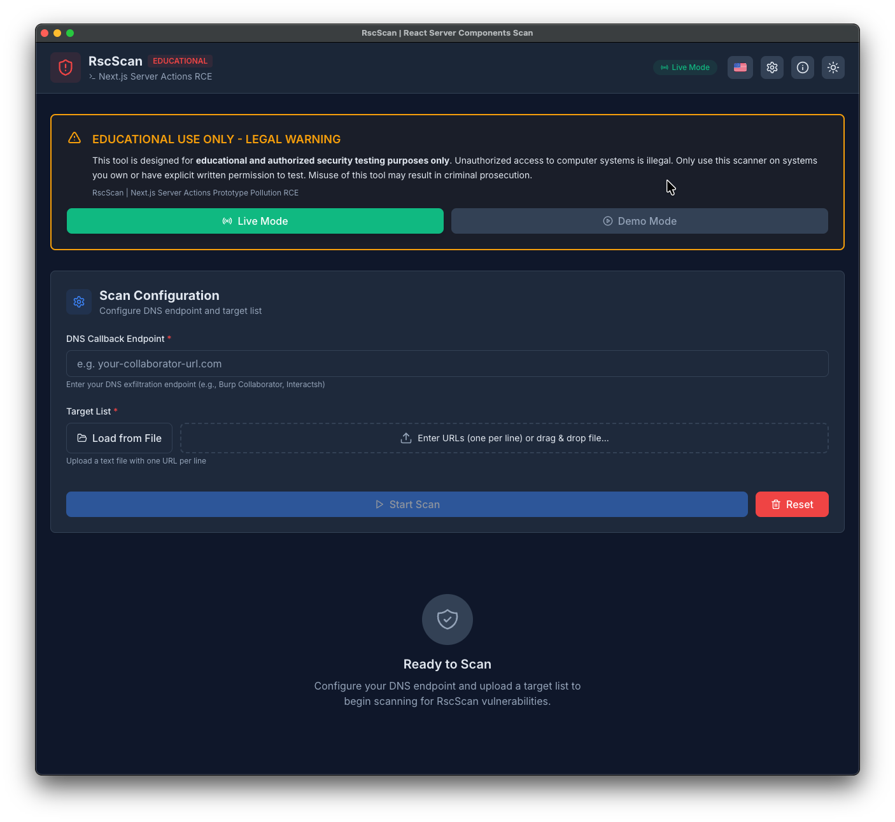
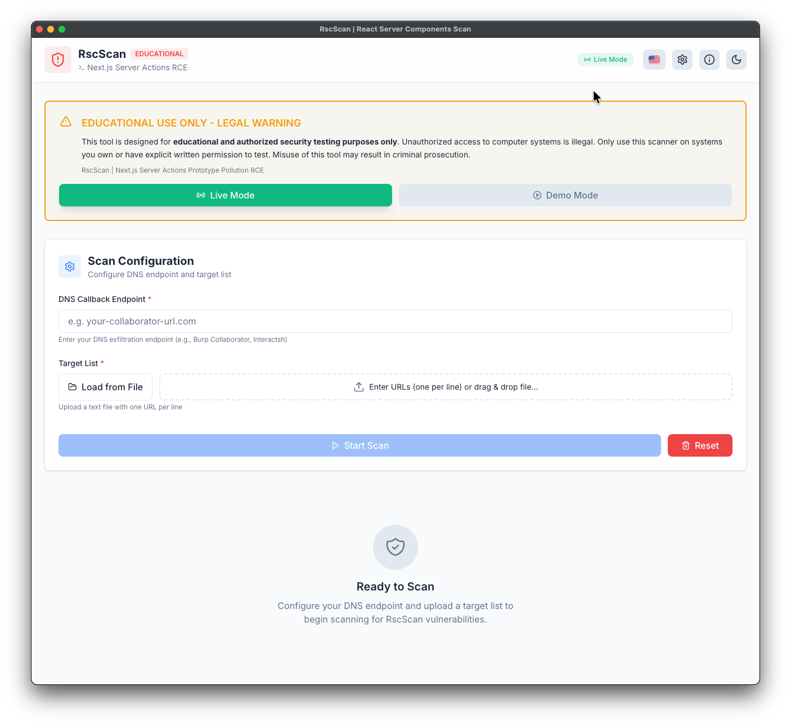

# RscScan - Next.js Server Actions Schwachstellenscanner

<div align="center">


**Professioneller plattformübergreifender Schwachstellenscanner für Next.js Server Actions RCE**

[Funktionen](#-funktionen) • [Installation](#-installation) • [Verwendung](#-verwendung) • [Vorschau](#-video-demonstration) • [Screenshots](#-screenshots)

</div>

---

## ⚠️ RECHTLICHER HINWEIS

**DIESES WERKZEUG IST NUR FÜR BILDUNGSZWECKE UND AUTORISIERTE SICHERHEITSTESTS BESTIMMT.**

- ❌ **NICHT** auf Systemen verwenden, die Ihnen nicht gehören oder für die Sie keine schriftliche Erlaubnis haben.
- ❌ **NICHT** für böswillige Zwecke verwenden.
- ✅ **NUR** im Rahmen autorisierter Penetrationstests verwenden.
- ✅ **NUR** für Bildungsforschung und Lernen verwenden.

**Unbefugter Zugriff auf Computersysteme ist illegal.** Missbrauch kann strafrechtlich verfolgt werden.

**Durch die Nutzung dieses Tools stimmen Sie zu, es verantwortungsvoll und legal zu verwenden.**

---

## 📋 Inhaltsverzeichnis

- [Über](#-über)
- [Funktionen](#-funktionen)
- [Technologie-Stack](#-technologie-stack)
- [Herunterladen](#-herunterladen)
- [Installation](#-installation)
- [Verwendung](#-verwendung)
- [Video Demonstration](#-video-demonstration)
- [Screenshots](#-screenshots)
- [Mehrsprachige Unterstützung](#-mehrsprachige-unterstützung)
- [Erstellen](#-erstellen)
- [Testen](#-testen)
- [Projektstruktur](#-projektstruktur)
- [Mitwirken](#-mitwirken)
- [Lizenz](#-lizenz)

---

## 🔍 Über

**RscScan** ist ein professionelles Sicherheitstool zur Erkennung von CVE-2025-55182, einer kritischen Remote Code Execution (RCE) Schwachstelle in Next.js Server Actions. Die Schwachstelle resultiert aus einem Prototype Pollution Problem, das es Angreifern ermöglicht, beliebigen Code auf dem Server auszuführen.

### Details zur Schwachstelle

| Eigenschaft | Wert |
|----------|-------|
| **CVE ID** | CVE-2025-55182 |
| **CVSS Score** | 9.8 (Kritisch) |
| **Betroffen** | Next.js Server Actions |
| **Typ** | Prototype Pollution (CVE-2025-55182) → Remote Code Execution |
| **Vektor** | HTTP POST Anfrage mit schädlichen Multipart Form Daten |

---

## ✨ Funktionen

### Kernfunktionalität
- 🎯 **Multithreaded Scanning** - Gleichzeitiges Scannen von bis zu 30 Zielen
- 📊 **Echtzeit-Fortschrittsverfolgung** - Live-Fortschrittsbalken mit Prozentsatz
- 📈 **Statistik-Dashboard** - Visuelle Statistiken für Ergebnisse
- 🔍 **Erweiterte Filterung** - Suchen und Filtern nach Status, URL oder Nachricht
- 📤 **Mehrere Exportformate** - Export als JSON oder CSV
- 🎭 **Demo-Modus** - Sicherer Testmodus mit simulierten Ergebnissen

### Desktop-Anwendung
- 🖥️ **Plattformübergreifend** - Unterstützung für Windows, macOS und Linux
- 📁 **Native Dateidialoge** - Systemdateiauswahl für Ziellisten
- 💾 **Native Speicherdialoge** - Speichern von Exporten mit Systemdialog
- 🔔 **In-App-Benachrichtigungen** - Toast-Benachrichtigungen nach Scan-Abschluss
- 🪟 **Fensterzustand** - Merkt sich Fenstergröße und -position
- 🎨 **System Tray Integration** - Minimieren in den System Tray

### Benutzeroberfläche
- 🌍 **Mehrsprachige Oberfläche** - Englisch, Persisch, Russisch, Deutsch und Chinesisch
- 🌓 **Dunkel/Hell Design** - Automatischer Wechsel basierend auf Systemeinstellungen
- 📱 **Responsive Design** - Funktioniert nahtlos auf Desktop, Tablet und Handy
- ⌨️ **Tastaturkürzel** - Schnelle Aktionen mit Shortcuts
- 🎨 **Professionelles Design** - Saubere, moderne Oberfläche

---

## 🛠 Technologie-Stack

### Frontend
- **React 19.2.1**
- **Vite 5.3**
- **Tailwind CSS 4.1**
- **Lucide React**

### Internationalisierung
- **i18next 25.x**
- **react-i18next 16.x**
- **i18next-browser-languagedetector**

### Desktop Framework
- **Electron 28**
- **Electron Builder 24.9**

### HTTP Client
- **Axios 1.13**

---

## 📥 Herunterladen

<div align="left">
<table>
    <thead align="left">
        <tr>
            <th>Betriebssystem</th>
            <th>Herunterladen</th>
        </tr>
    </thead>
    <tbody align="left">
        <tr>
            <td>Windows</td>
            <td>
                <a href="https://github.com/VeilVulp/Rscscan/releases/latest/download/Rscscan-Windows-Setup-x64.Msix"></a><br>
                <a href="https://github.com/VeilVulp/Rscscan/releases/latest/download/Rscscan-Windows-Setup-x64.exe"></a><br>
                <a href="https://github.com/VeilVulp/Rscscan/releases/latest/download/Rscscan-Windows-Portable-x64.zip"></a>
            </td>
        </tr>
        <tr>
            <td>macOS</td>
            <td>
                <a href="https://github.com/VeilVulp/Rscscan/releases/latest/download/Rscscan-MacOS.dmg"></a><br>
                <a href="https://github.com/VeilVulp/Rscscan/releases/latest/download/Rscscan-MacOS-Installer.pkg"></a>
            </td>
        </tr>
        <tr>
            <td>Linux</td>
            <td>
                <a href="https://github.com/VeilVulp/Rscscan/releases/latest/download/Rscscan-Linux-x64.AppImage"> </a><br>
                <a href="https://github.com/VeilVulp/Rscscan/releases/latest/download/Rscscan-Debian-x64.deb"> </a><br>
                <a href="https://github.com/VeilVulp/Rscscan/releases/latest/download/Rscscan-rpm-x64.rpm"> </a>
            </td>
        </tr>
    </tbody>
</table>

</div>

---

## 📦 Installation

### Voraussetzungen

- **Node.js** 18.x oder höher
- **npm** 9.x oder höher
- **Git**

### Repository klonen

```bash
git clone https://github.com/VeilVulp/Rscscan.git
cd Rscscan
```

### Abhängigkeiten installieren

```bash
npm install
```

---

## 🚀 Verwendung

### Webanwendung (Entwicklungsmodus)

Für UI-Entwicklung:

```bash
npm run dev
```
Die Anwendung öffnet sich unter `http://localhost:5173`.

### Desktop-Anwendung

#### Entwicklungsmodus

```bash
npm run electron:dev
```

#### Production Build

Siehe [BUILD_GUIDE.md](BUILD_GUIDE.md) für detaillierte Anweisungen.

---

## 🎥 Video Demonstration

<video src="screenshots/demo.mp4" controls="controls" style="max-width: 100%;">
</video>

**[🎬 Video in hoher Qualität ansehen](screenshots/demo.mp4)**

*Komplette Anleitung: Installation → Konfiguration → Mehrsprachigkeit → Scannen → Exportieren*

</div>

---

## 📸 Screenshots

<div align="center">

<table width="100%">
  <tbody>
    <tr>
      <td align="center" width="50%">
        <h4>🌙 Dunkelmodus</h4>
        
      </td>
      <td align="center" width="50%">
        <h4>☀️ Hellmodus</h4>
        
      </td>
    </tr>
  </tbody>
</table>

</div>

---

## 🏗️ Erstellen

```bash
# Build für aktuelle Plattform
npm run electron:build
```

---

## 📁 Projektstruktur

```text
rscscan/
├── electron/                    # Electron main process files
│   ├── main.cjs                 # Main process entry point
│   ├── preload.cjs              # Preload script (IPC bridge)
│   └── builder.config.cjs       # Electron Builder configuration
├── src/
│   ├── main.jsx                 # React entry point
│   ├── App.jsx                  # Main application component
│   ├── index.css                # Global styles and Tailwind
│   ├── i18n.js                  # i18next configuration
│   ├── components/              # React components
│   ├── services/                # Business logic
│   ├── hooks/                   # Custom React hooks
│   ├── utils/                   # Utility functions
│   ├── locales/                 # Translation files
│   │   ├── en/                  # English translations
│   │   ├── fa/                  # Persian translations
│   │   ├── ru/                  # Russian translations
│   │   ├── de/                  # German translations
│   │   └── zh/                  # Chinese translations
│   └── tests/                   # Unit tests
├── screenshots/                 # Application screenshots
├── build/                       # Build resources
├── public/                      # Public assets
└── release/                     # Built applications (generated)
```

---

## 🤝 Mitwirken

Beiträge sind willkommen! Bitte lesen Sie [CONTRIBUTING.md](CONTRIBUTING.md).

---

## 📄 Lizenz

MIT License

Copyright (c) 2025 VeilVulp

---

## 📞 Support

- **Issues:** [GitHub Issues](https://github.com/VeilVulp/Rscscan/issues)
- **E-Mail:** veilvulp@outlook.com
- **Instagram:** [@VeilVulp](https://www.instagram.com/veilvulp)
- **YouTube:** [@VeilVulp](https://www.youtube.com/@VeilVulp)

---

<div align="center">

**Denken Sie daran: Verwenden Sie dieses Tool verantwortungsbewusst und legal.**

[⬆ Zurück nach oben](#rscscan---nextjs-server-actions-schwachstellenscanner)

</div>
